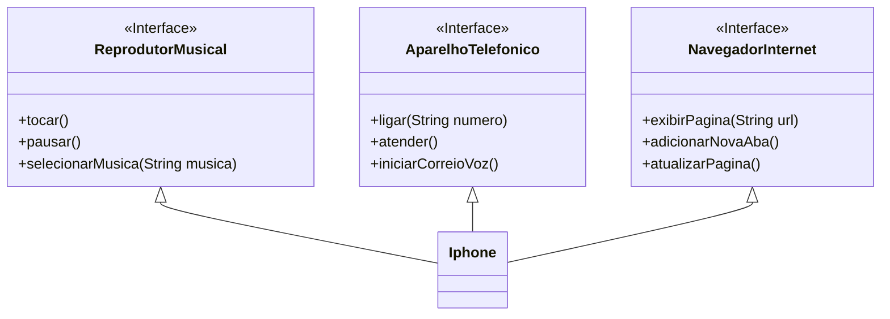

## Desafio Java Básico / Diagrama Iphone ☕

Aicionei ao projeto, na classe Banco, métodos que incluem as contas criadas e imprimem a lista de contas para cada usuário.

```mermaid
classDiagram
    class ReprodutorMusical
    <<Interface>>ReprodutorMusical
    class AparelhoTelefonico
    <<Interface>>AparelhoTelefonico
    class NavegadorInternet
    <<Interface>>NavegadorInternet
    
    ReprodutorMusical : +tocar()
    ReprodutorMusical : +pausar()
    ReprodutorMusical : +selecionarMusica(String musica)
    AparelhoTelefonico : +ligar(String numero)
    AparelhoTelefonico : +atender()
    AparelhoTelefonico : +iniciarCorreioVoz()
    NavegadorInternet: +exibirPagina(String url)
    NavegadorInternet: +adicionarNovaAba()
    NavegadorInternet: +atualizarPagina()


    ReprodutorMusical <|-- Iphone
    AparelhoTelefonico <|-- Iphone
    NavegadorInternet <|-- Iphone
    class Iphone{
      
    }
```

## Ferramentas

