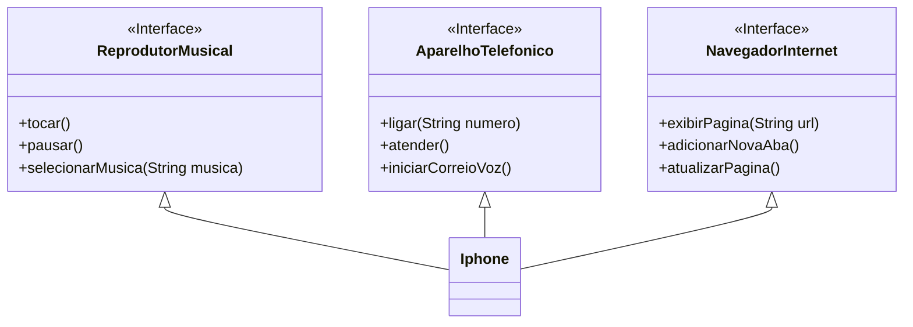

## Desafio Java Básico / Diagrama Iphone ☕

Diagrama de classes baseado no iphone, são 3 classes interface `ReprodutorMusical`, `AparelhoTelefonico` e `NavegadorInternet`. Elas são implentadas pela classe `Iphone`

# Modelo diagrama de classes #

## Ferramentas

